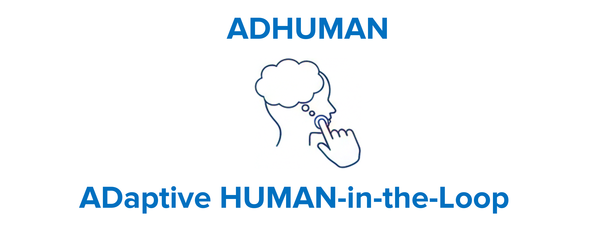

  

# ADHUMAN: A Reference Architectural Framework/Model for Integrating Human-in-the-Loop into Self-Adaptive Systems

ADHUMAN is a reference architectural model designed for integrating Human-in-the-Loop capabilities into self-adaptive systems. It functions as an extension of the MAPE-K loop, introducing formal mechanisms for human intervention and ensuring the persistence of acquired human knowledge within the system.

